# md-fit-all

> Fit any Markdown into any editor.

**md-fit-all** (`mdfit`) is a profile-driven Markdown dialect converter focused on one painful
workflow: copying LLM output (ChatGPT / Claude / Gemini) into note editors (Obsidian / Typora) or
publishing targets (GitHub) — without manually fixing math delimiters, headings, citations,
tables or spacing ever again.

Copy from ChatGPT → press `Ctrl+Alt+V` → paste into Obsidian. Zero manual cleanup.



## Why

Every editor wants a slightly different Markdown, and every chatbot emits its own dialect:

- ChatGPT writes math as `\(x^2\)` / `\[E=mc^2\]` — Obsidian/Typora only render `$x^2$` / `$$…$$`
- Answers start at `###`, landing three levels deep in your notes for no reason
- Browser-copied text carries citations (`【1†source】`), `Copy code` chrome, zero-width characters
- Existing tools solve one slice each, usually only inside Obsidian — Typora users get nothing

`mdfit` works at the **clipboard level**, so it covers every editor. Built on an AST pipeline
([unified](https://unified.sh)/remark) with **protected code segments** — your code blocks are
never touched by regex. **Idempotent by design**: converting twice changes nothing.

## Install

From npm:

```bash
npm install -g @naloam/mdfit
```

No install? Try it instantly:

```bash
npx @naloam/mdfit clip --to obsidian -y
```

Scoop (Windows):

```bash
scoop bucket add mdfit https://github.com/Naloam/md-fit-all --subdir scoop
scoop install mdfit
```

From source:

```bash
git clone https://github.com/Naloam/md-fit-all
cd md-fit-all
pnpm install && pnpm build
npm link --prefix ./packages/cli   # or run node packages/cli/dist/index.js
```

## Usage

```bash
# Transform your clipboard in place — the daily driver
mdfit clip --to obsidian -y

# Prefer the clipboard's HTML flavor (when copying from rendered pages)
mdfit clip --html --to obsidian

# Preview what would change, then confirm
mdfit clip --to obsidian --diff

# Convert files
mdfit convert notes.md --from chatgpt --to obsidian -o out.md
cat raw.md | mdfit convert --to github > clean.md

# See what the auto-detector found
mdfit convert notes.md --verbose

# Batch-convert a whole vault (publish to GitHub, migrate, …)
mdfit convert-dir vault/ -o vault-github/ --to github --dry-run

# Rescue expiring chat images while converting
mdfit clip --to obsidian --download-images

# Autostart the daemon at logon (hidden, no admin needed)
mdfit serve --install

# Override any rule
mdfit clip --to github --rule cjkSpacing=true headings=keep

# Introspect profiles and rules
mdfit profiles list
mdfit rules list
mdfit config set defaultTo obsidian
```

## Global hotkey & daemon (Windows)

Install [AutoHotkey v2](https://www.autohotkey.com/), then double-click
[`scripts/hotkey.ahk`](./scripts/hotkey.ahk):

- `Ctrl+Alt+V` → clipboard converted for **Obsidian**
- `Ctrl+Alt+T` → clipboard converted for **Typora**

For near-instant hotkeys, keep the resident daemon running in a terminal
(autostart it if you like):

```bash
mdfit serve        # listens on http://127.0.0.1:7317
```

The hotkey script then hits the daemon via `curl` (~100 ms instead of
~1.4 s); `mdfit clip` also uses the daemon automatically when it is alive.
No AutoHotkey? `Win+R` → `mdfitt` / `mdfito` (aliases created on install
paths) or run `mdfit clip -y` directly.

## Reverse conversions & custom profiles

Obsidian targets now also convert *into* Obsidian idioms:

- `[note](note.md)` → `[[note]]` (relative `.md` links & local images only)
- `**Note:** text` → `> [!note] text` (EN + CJK labels)

Layer your own defaults with a profile JSON:

```bash
mdfit convert in.md --to obsidian --profile my-rules.json
```

## More surfaces

- **[Obsidian plugin](./packages/obsidian-plugin)** — paste interception inside
  Obsidian, zero hotkeys needed.
- **[Tampermonkey userscript](./packages/userscript)** — select any part of a
  chat answer and copy it as clean Markdown from the browser, with
  expired-URL image rescue (images are inlined as data URLs).

## Rules & Profiles

- [Rules reference](./docs/rules.md) — 11 conversion rules, each with guards and examples
- [Profiles reference](./docs/profiles.md) — sources (chatgpt/claude/gemini/generic/html) ×
  targets (obsidian/typora/github/commonmark)
- [Corpus](./corpus/README.md) — 18 golden-file cases asserting correctness, idempotency and
  code protection. Contributions welcome and easy.

## Development

```bash
pnpm install
pnpm test        # 120 tests: unit + corpus golden files
pnpm lint        # eslint
pnpm typecheck   # build + tsc --noEmit
pnpm build       # build all packages
```

Monorepo layout: `packages/core` (engine, zero environment deps) and `packages/cli`
(the `mdfit` command). See [CONTRIBUTING.md](./CONTRIBUTING.md) — adding a corpus case is the
highest-value contribution.

## License

[MIT](./LICENSE)
